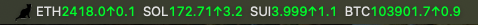

# 🪙 Crypto Live Price Tray App

A lightweight [Electron](https://www.electronjs.org/) app that shows **live cryptocurrency prices** in your system tray using **Binance WebSocket API**. Prices are updated in real-time with colored indicators for price movement.

---

## 📦 Features

- 🟢 Live streaming prices via Binance WebSocket  
- 🔻 Red and 🔺 Green arrows to indicate price movement  
- 📊 Customizable symbol order and decimal precision via config  
- 📌 Displays real-time prices directly in your tray title  

---

## 📁 File Structure

```
.
├── icon.png                # Tray icon image
├── index.js                # Main Electron app file
├── symbol.config.json      # List of symbols to track and their settings
├── package.json
└── README.md
```

---

## ⚙️ Configuration

Edit `symbol.config.json` to specify which symbols you want to track:

```json
[
  {
    "symbol": "BTC",
    "order": 1,
    "decimal": 1
  },
  {
    "symbol": "ETH",
    "order": 2,
    "decimal": 2
  }
]
```

Each entry:

- `symbol`: The crypto symbol (paired with USDT)  
- `order`: Display order in the tray  
- `decimal`: Decimal precision shown for that symbol  

---

## 🚀 Getting Started

### 1. Install dependencies

```bash
yarn install
```

### 2. Run the app

```bash
yarn start
```

### 3. You’ll see prices appear in your system tray 🎉

---

## 🧠 How It Works

- Symbols are pulled from `symbol.config.json`  
- A WebSocket connection is made to Binance using those symbols  
- Prices are parsed and colored using ANSI escape codes  
- The tray title is updated with the latest prices  

Display on macOS Menubar:



---

